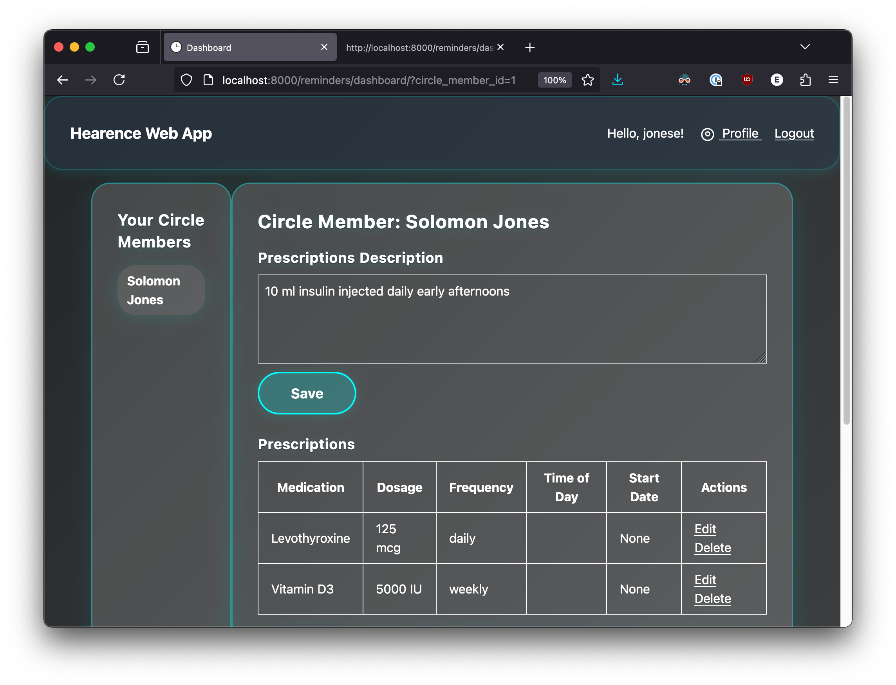

autoscale: true
theme: next, 1
code-language: Python

## AI In Healthcare, High Risk Project: 

### [Evan Jones](mailto:evan_jones@utexas.edu), UT ID:  `ej8387`

**Assignment source:**
[`https://github.com/etjones/aihc_hw8_high_risk_project_ej8387`](https://github.com/etjones/aihc_hw8_high_risk_project_ej8387)

**Paper PDF:**
[`https://github.com/etjones/aihc_hw8_high_risk_project_ej8387/blob/main/assets/evan_jones_high_risk_project_ej8387.pdf`](https://github.com/etjones/aihc_hw8_high_risk_project_ej8387/blob/main/assets/evan_jones_high_risk_project_ej8387.pdf)

**Presentation PDF:**
[`https://github.com/etjones/aihc_hw8_high_risk_project_ej8387/blob/main/assets/high_risk_project_presentation_eje8387.pdf`](https://github.com/etjones/aihc_hw8_high_risk_project_ej8387/blob/main/assets/high_risk_project_presentation_eje8387.pdf)

**Presentation Video:**
[`https://utexas.hosted.panopto.com/Panopto/Pages/Viewer.aspx?id=6ecef5ef-00df-498d-aec8-b2ce002bceae`](https://utexas.hosted.panopto.com/Panopto/Pages/Viewer.aspx?id=6ecef5ef-00df-498d-aec8-b2ce002bceae)

^ Hi. I'm Evan Jones, and welcome to my High Risk Project presentation. 
Follow the links to the separate sections of the assignment, and let's get started

--- 

# Medication Adherence is crucial — And hard

Lots of conditions (diabetes, schizophrenia, etc.) are manageable with current medications-- we've solved them!

But patients often can't or don't maintain their medicine regimes. 
Doctors call this problem *Adherence*, and it affects us all.

^ This is a project about *adherence*, how to get people to follow medical advice, 
specifically to take drugs they've been prescribed, when they're supposed to.

^ Lots of conditions- most visibly diabetes and schizophrenia, are largely manageable
with correct medication. It's not that we don't know what to give people, it's 
that we don't know how to convince people to take the drugs they've been prescribed.

^ Adherence affects us all-- just think about the last time your doctor told you
to eat healthier and exercise more. If we could follow the good advice we get, we'd all be better off

---

# Basic Reminders Don't Help Much

[Lots](https://pubmed.ncbi.nlm.nih.gov/16418141/) of [research](https://pmc.ncbi.nlm.nih.gov/articles/PMC6511120/) exists to try to [improve](https://pmc.ncbi.nlm.nih.gov/articles/PMC6613929) medication adherence. 

Nothing works as well as conversations with patients' loved ones.

(See my accompanying [paper](https://github.com/etjones/aihc_hw8_high_risk_project_ej8387/blob/main/assets/evan_jones_high_risk_project_ej8387.pdf) for references to adherence research.)

^ Check out my accompanying paper for different techniques in use to increase
medication adherence. The basic gist is that there's no silver bullet.

---

# Proposal: Relationship-Based Reminders

We can't give every patient a conversation with their loved ones every day.
 
But maybe we can get closer. 
 
AI tools let us automate the kinds of conversations that have the biggest impact on patients.

^ We can't give every patient a conversation with their loved ones every day.

^ But maybe we can get closer. 

^ AI tools let us automate the kinds of conversations that have the biggest impact on patients.

--- 

# Hearance: An AI Powered, Relationship-based, Medication Adherence System

**Hearance makes daily contact with patients to talk about their medications.**
- Instead of text messages, patients get phone calls
- Instead of just getting a reminder, patients have ongoing conversations
- Conversations are summarized and stored to inform future conversations and caregivers

^ My project is a system called Hearance. 
Hearance makes daily contact with patients to talk about their medications.
- Instead of text messages, patients get phone calls
- Instead of just getting a reminder, patients have ongoing conversations
- Conversations are summarized and stored to inform future conversations and caregivers
  
---

# Project Sections:

- Web app for managing medication schedules
- LLM-based conversation system
- Database storage for tracking daily conversations

^ I'll run through the three sections of the project

---

# 1. Hearance Web App

- GPT 4.1 helped assemble a Django-based application to set up medication schedules
- Family members, caregivers, or patients themselves can sign up to get notifications for their medications
- Every day, the app initiates a call to patients.
- After conversations, a digest and recording is made available on the web app for each conversation

^ First, the Hearance Web App. 
- I used GPT 4.1 to write a Django application to set up medication schedules.
- Family members, caregivers, or patients themselves can sign up to get notifications for their medications
- Every day, the app initiates a call to patients.
- After conversations, a digest and recording is made available on the web app for each conversation
  
---

# 2. Conversation system

- We use the open source [Vocode](https://docs.vocode.dev/welcome) open source library for building conversational agents. 
- More development is needed here; Vocode stitches together many different LLM-based services, and the experience isn't quite ready for product-level use. 

^ Second, the conversation system itself, which is initiated by the web app every day
for each patient.
I worked to integrate the open source voice library Vocode to manage transcriptions 
and phone conversations, but the project really fell down here. I feel confident 
in the conversation design which you can see in the system prompt I use here, but 
if I were continuing this project, I'd use a different telephony system.

---

# 3. Stored conversation digests

After a conversation, the recording is submitted to an LLM for summarization.
Summaries are available in the web app so caregivers can check progress

(Possible future use: contact caregivers if patients report new symptoms)

^ After a conversation, the recording is submitted to an LLM for summarization.
Summaries are available in the web app so caregivers can check progress

^ (One possible future feature I'd like to add is contacting family or caregivers if 
patients talking to the AI mention any new or troubling symptoms)

---

# Setbacks and incomplete work

- Conversation system wasn't completely implemented
- LLM-based tools need a lot of tweaking to be reliable and robust (Failed so far: medication lists from natural language)
- Two-way conversations still lag in responsiveness
- Open-source telephony solutions are still fragile
- High costs of phone-based AI conversations

--- 

# Project Cautions

- HIPAA concerns: we may gather a lot of potentially sensitive data, handle it with LLMs without privacy guarantees, and share it with caregivers 
- Fraud Risk: automating satisfying conversations with vulnerable individuals is a fraudster's dream

--- 

# Experimental Validation Plans

- To show Hearance is effective, we'd need to run randomized controlled trials
- Experimental Conditions:
  - No intervention
  - Automated reminders
  - Conversational AI reminders (Hearance)
  - Family member reminders

^ To demonstrate that the Hearance system is effective at increasing adherence,
we'd want to run larger randomized controlled trials with a few different conditions
to compare Hearance against other adherence-increasing modalities. 

  --- 

  # Thank You For Watching

