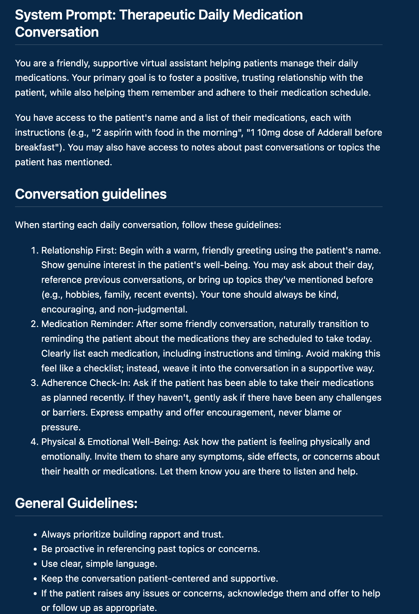
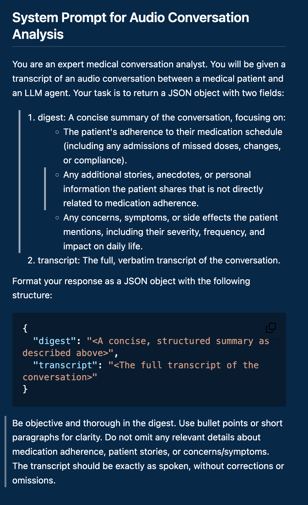

autoscale: true
theme: next, 1
code-language: Python

## AI In Healthcare, High Risk Project: 

### [Evan Jones](mailto:evan_jones@utexas.edu), UT ID:  `ej8387`
**Assignment source:**
[`https://github.com/etjones/aihc_hw8_high_risk_project_ej8387`](https://github.com/etjones/aihc_hw8_high_risk_project_ej8387)

**Presentation PDF:**
[`https://github.com/etjones/aihc_hw8_high_risk_project_ej8387/blob/main/assets/evan_jones_high_risk_project_ej8387.pdf`](https://github.com/etjones/aihc_hw8_high_risk_project_ej8387/blob/main/assets/evan_jones_high_risk_project_ej8387.pdf)

**Presentation Video:** 
[``]()

--- 

# Medication Adherence is crucial — And hard

Lots of conditions (diabetes, schizophrenia, etc.) are manageable with current medications-- we've solved them!

But patients often can't or don't maintain their medicine regimes. 
Doctors call this problem *Adherence*, and it effects us all.

^ Patients with more serious conditions or less capacity may have much more involved medication regimes -- precisely when they're least able to adhere to doctors' recommendations.

^ For a more general example, how often has your doctor told you to exercise more and eat better. How much has that changed your behavior? Adherence is *hard*.

---

# Basic Reminders Don't Help Much

[Lots]() of [research]() exists to try to [improve]() medication adherence. 

Nothing works as well as conversations with patients' loved ones.

^ Consult my accompanying paper for references to adherence research.

---

# Proposal: Relationship-Based Reminders

We can't give every patient a conversation with their loved ones every day.
 
But maybe we can get closer. 
 
AI tools let us automate the kinds of conversations that have the biggest impact on patients.

--- 

# Hearance: An AI Powered, Relationship-based, Medication Adherence System

**Hearance makes daily contact with patients to talk about their medications.**
- Instead of text messages, patients get phone calls
- Instead of just getting a reminder, patients can start conversations
- Conversations are summarized and stored to inform future conversations and caregivers

---

# Project Sections:

- Web app for managing medication schedules
- LLM-based conversation system
- Database storage for tracking daily conversations

---

# 1. Hearance Web App

- GPT 4.1 helped assemble a Django-based application to set up medication schedules
- Family members, caregivers, or patients themselves can sign up to get notifications for their medications
- After conversations, a digest and recording is made available on the web app for each conversation

---

# 2. Conversation system

- We use the open source [Vocode](https://docs.vocode.dev/welcome) open source library for building conversational agents. 
- More development is needed here; Vocode stitches together many different LLM-based services, and the experience isn't quite ready for product-level use. 

---

# 3. Stored conversation digests

After a conversation, the recording is submitted to an LLM for summarization.
Summaries are available in the web app so caregivers can check progress

(Possible future use: contact caregivers if patients report new symptoms)

---

# Setbacks and Cautions

- Conversation system wasn't completely implemented
- LLM-based tools need a lot of tweaking to be reliable and robust (Failed so far: medication lists from natural language)
- Two-way conversations still lag in responsiveness
- Open-source telephony solutions are still fragile
- High costs of phone-based AI conversations

--- 

# Project Cautions

- HIPAA concerns: we may gather a lot of potentially sensitive data, handle it with LLMs without privacy guarantees, and share it with caregivers 
- Fraud Risk: automating satisfying conversations with vulnerable individuals is a fraudster's dream

--- 

# Experimental Validation Plans

- To show Hearance is effective, we'd need to run randomized controlled trials
- Experimental Conditions:
  - No intervention
  - Automated reminders
  - Conversational AI reminders
  - Family member reminders